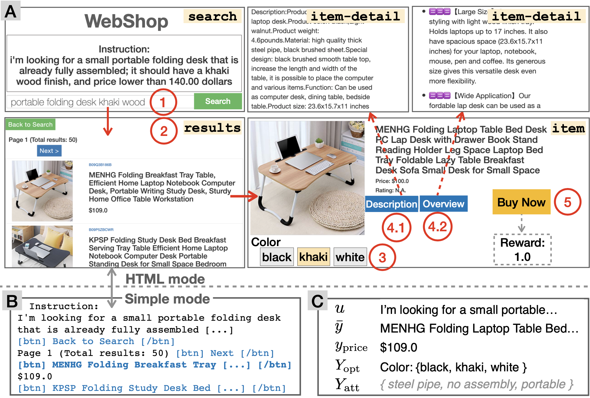

## Abstract

Existing benchmarks for grounding language in interactive environments either lack real-world linguistic elements, or prove difficult to scale up due to substantial human involvement in the collection of data or feedback signals. To bridge this gap, we develop WebShop – a simulated e-commerce website environment with 1.18 million real-world products and 12,087 crowd-sourced text instructions. Given a text instruction specifying a product requirement, an agent needs to navigate multiple types of webpages and issue diverse actions to find, customize, and purchase an item. WebShop provides several challenges for language grounding including understanding compositional instructions, query (re-)formulation, comprehending and acting on noisy text in webpages, and performing strategic exploration. We collect over 1,600 human demonstrations for the task, and train and evaluate a diverse range of agents using reinforcement learning, imitation learning, and pre-trained image and language models. Our best model achieves a task success rate of 29%, which outperforms rule-based heuristics (9.6%) but is far lower than human expert performance (59%). We also analyze agent and human trajectories and ablate various model components to provide insights for developing future agents with stronger language understanding and decision making abilities. Finally, we show that agents trained on WebShop exhibit non-trivial _sim-to-real_ transfer when evaluated on [amazon.com](https://www.amazon.com/), indicating the potential value of WebShop in developing practical web-based agents that can operate in the wild.

## WebShop Environment

<div style="text-align:center;">
    
</div>

The diagram's components are as follows:

- A: An example task trajectory in HTML mode, where a user can
  - (1) search a query in a search page
  - (2) click a product item in a results page
  - (3) choose a color option in a item page
  - (4) check item-detail pages and go back to the item page
  - (5) finally buy the product to end the episode and receive and reward.
- B: The results page in simple mode for agent training and evaluation. The <span style="color:blue">blue</span> text indicates clickable actions and **bold** text indicates the action selected by the agent.
- C: The product notation (described in section 3 of the paper) corresponding to the product in A. The attributes $$Y_{att}$$ are hidden from the task performer.

## Demo

### Interactive Web App

<iframe src="https://hf.space/gradioiframe/webshop/amazon_shop/+" width="100%" height=900></iframe>

### Trajectories

The below slides show the step-by-step actions of trajectories generated from different agents and entities performing the task of searching for a product based on a goal instruction.

**Goal Instruction**: I'm looking for a quick-release replacement fitness strap band; it should match my chic teal fitbit, and price lower than 40.00 dollars

These first four slideshows showcase trajectories by an MTurk worker, Rule Based Heuristic Imitation Learning Agent, and Imitation Learning + Reinforcement Learning Agent searching for a product on WebShop given the same goal instruction.

<div style="text-align:center;">
    <iframe src="https://docs.google.com/presentation/d/e/2PACX-1vRv8w_xsn8Y2dIH9bteRaR74gGv0TDdCYBa460JNefCa5pmbrwxc5FFUCzk2dx-ElVsy99dMcyme2Vh/embed?start=false&loop=false&delayms=10000" frameborder="0" width="49%" height="300" allowfullscreen="true" mozallowfullscreen="true" webkitallowfullscreen="true"></iframe>
    <iframe src="https://docs.google.com/presentation/d/e/2PACX-1vQa-LV0_ElycuIjva2TLwj3LKdZfhbEgGX0rzZbt1a6Jjkl9t-pcakCJMGRiJV_wnUrfptvCN_x_cm0/embed?start=false&loop=false&delayms=10000" frameborder="0" width="49%" height="300" allowfullscreen="true" mozallowfullscreen="true" webkitallowfullscreen="true"></iframe>
</div>
<div style="text-align:center;">
    <iframe src="https://docs.google.com/presentation/d/e/2PACX-1vR2xraC_z1pX4J7Ajb00MmqFBj5HwXu88sLz7a8bp6rNTydoWJEWc1qUsfFLLgtUa1boM0Y3c8OhSN2/embed?start=false&loop=false&delayms=10000" frameborder="0" width="49%" height="300" allowfullscreen="true" mozallowfullscreen="true" webkitallowfullscreen="true"></iframe>
    <iframe src="https://docs.google.com/presentation/d/e/2PACX-1vTZ8tS8jgniUgVw2MGLxmih5fj-8GQdxKNOM3gYpPlLY91Tj6bSM39qpqfdoqQI00I8QhyAae_7P1eM/embed?start=false&loop=false&delayms=10000" frameborder="0" width="49%" height="300" allowfullscreen="true" mozallowfullscreen="true" webkitallowfullscreen="true"></iframe>
</div>

_Sim-to-real Transfer_: This last slideshow shows a trajectory generated by an Imitation Learning agent searching on the www.amazon.com website, achieved via sim-to-real transfer logic.

<div style="text-align:center;">
    <iframe src="https://docs.google.com/presentation/d/e/2PACX-1vRmGmWmt5PInGy4qSG7JZg9LcDAHULrH8sGY2QIXyD55KsikNxMZ5nhlPHYrB_nOa8g8DtIIqJolfjD/embed?start=false&loop=false&delayms=10000" frameborder="0" width="49%" height="300" allowfullscreen="true" mozallowfullscreen="true" webkitallowfullscreen="true"></iframe>
</div>

## Citation

```
@inproceedings{yao2022webshop,
  bibtex_show = {true},
  title = {WebShop: Towards Scalable Real-World Web Interaction with Grounded Language Agents},
  author = {Yao, Shunyu and Chen, Howard and Yang, John and Narasimhan, Karthik},
  booktitle = {ArXiv},
  year = {preprint},
  html = {https://arxiv.org/abs/2207.01206},
  tag = {NLP}
}
```
